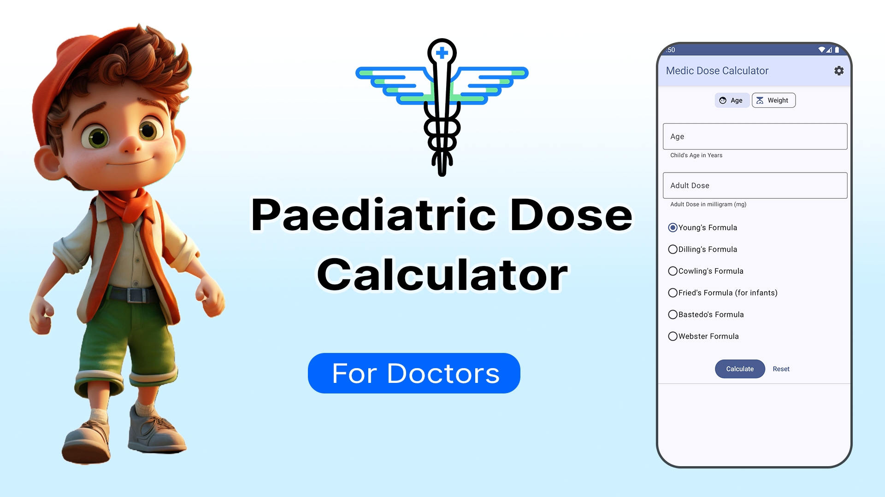
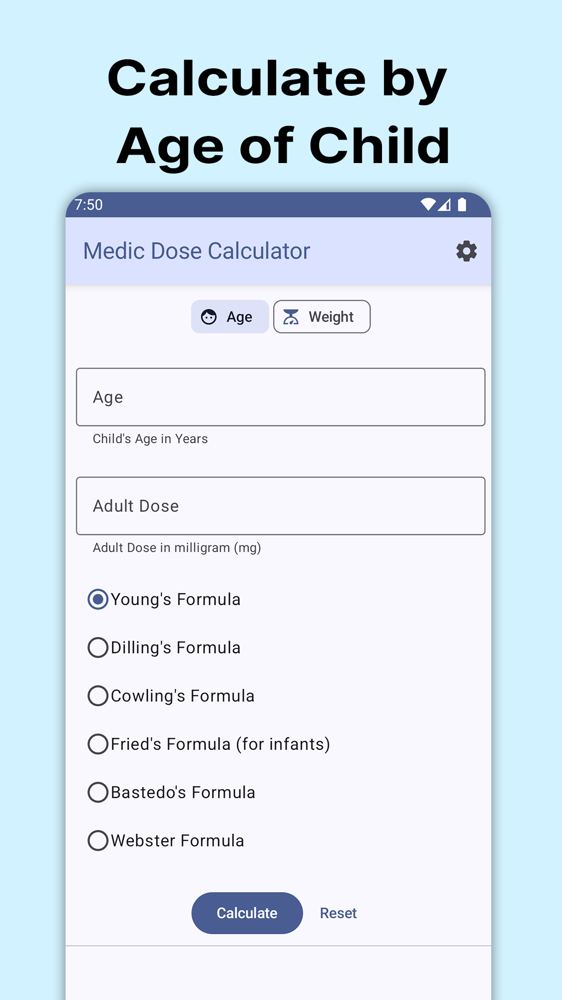
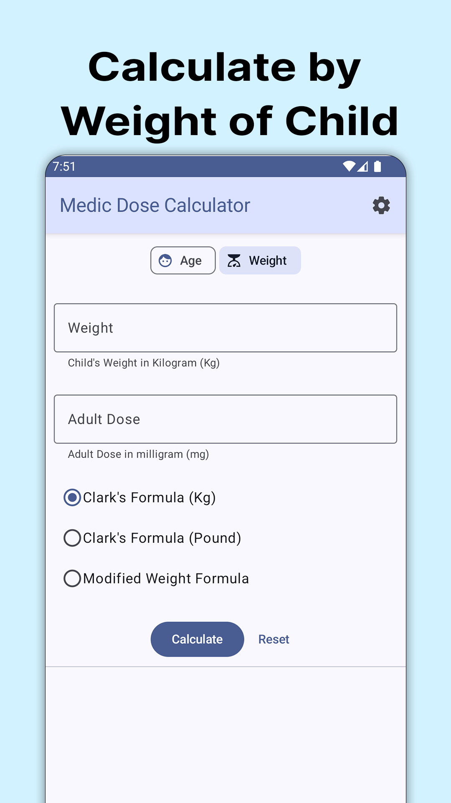
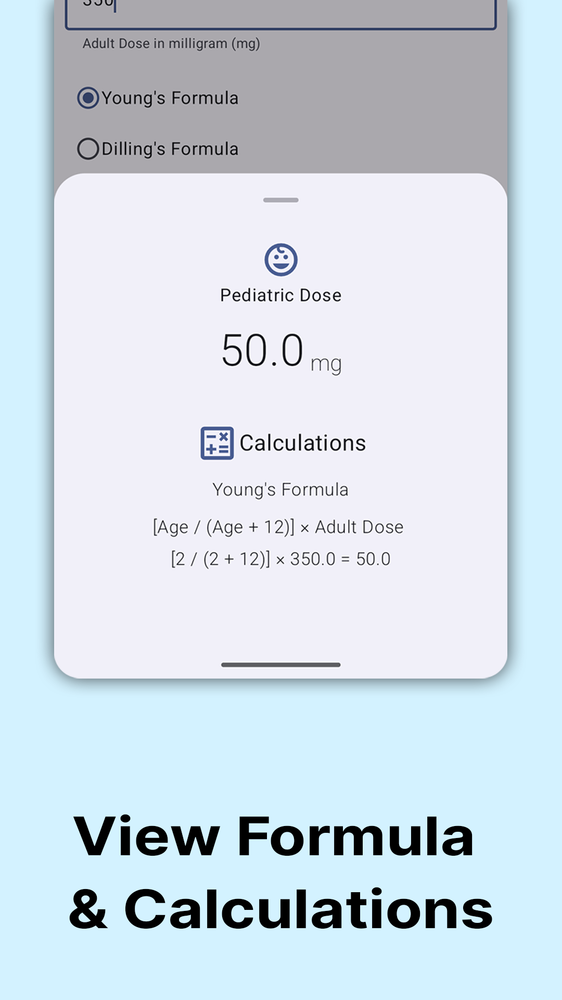
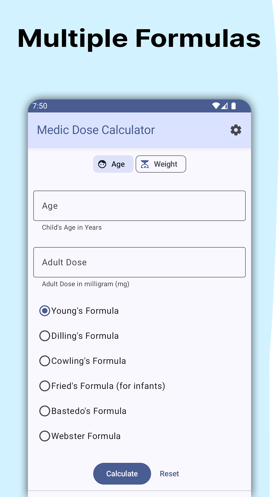

# Medic Dose Calculator
## A Paediatric dose calculator for Doctors & Pharmacist

[Download From Play Store](https://play.google.com/store/apps/details?id=devesh.medic.dose)

Medic Dose Calculator is a app to Measure proper paediatric dose of medicine according to adult dose of that medicine.
App is specially made for Doctors & pharmacist.

Exact dose of any given medicine produces the desired therapeutic effect which varies from person to person. Children do not react to all medicines in same way as the adults and with few exceptions, medicines are more active and more toxic to children than adults if dosage of  medicine is not accurate. To solve this problem accurate dosage is calculated by various pharmaceutical formulas.

### Features:
* Can calculate accurate paediatric dose from Age & Weight of child
* Various Pharmaceutical formulas are used: Young's formula, Dilling's formula, Cowling's formula, Fried's formula(for infants), Bastedo's formula.
* Easy-to-use for any person who don't have knowledge of medicine/dosage.
* View Full Maths Calculations & Formula 

### Screenshots

